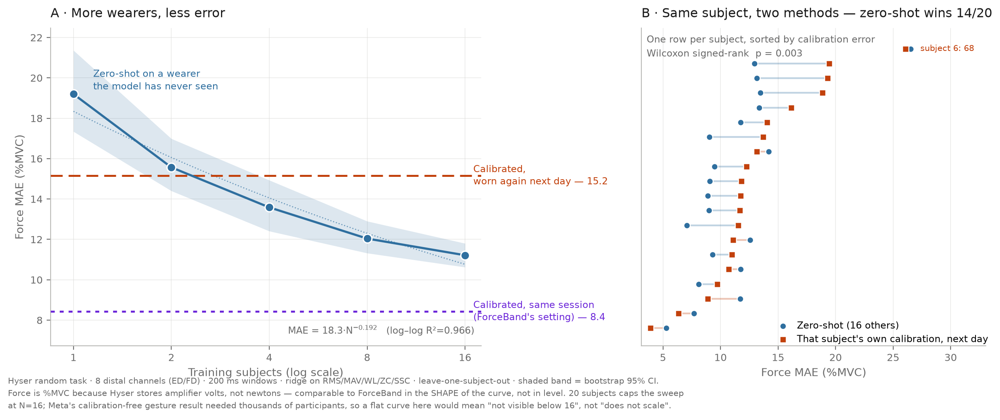
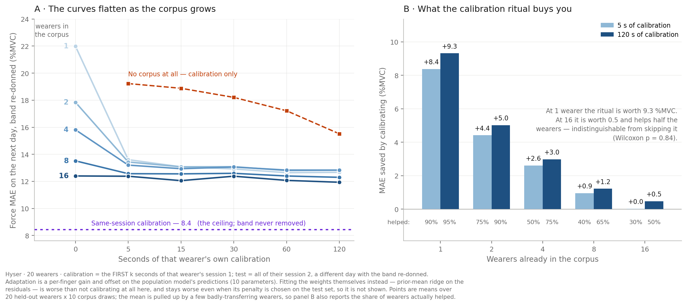

# EMG → force: what does an extra wearer buy you?

Cross-subject force decoding from surface EMG, measured on public data, with no hardware.

Two questions, both of which a wrist-EMG product has to answer before it can write its
out-of-box experience:

1. **Does force error fall as you add wearers to the training corpus, and in what shape?**
2. **Given N wearers already in the corpus, how much per-user calibration do you still need?**

Short answers: **yes, as a power law** — and **the calibration ritual buys less and less until,
by 16 wearers, it is no longer distinguishable from skipping it.**



---

## What came out

### 1 · A power law in wearer count

```
MAE = 18.3 · N^(−0.192)        log–log R² = 0.966       N = 1, 2, 4, 8, 16
```

| Training wearers | Zero-shot MAE on an unseen wearer |
|---|---|
| 1 | 19.2 %MVC |
| 2 | 15.6 |
| 4 | 13.6 |
| 8 | 12.0 |
| 16 | **11.2** |

### 2 · Taking the band off costs about as much as never training on the wearer

| Setting | MAE |
|---|---|
| Same session, band never removed | **8.4 %MVC** |
| Same wearer, next day, band re-donned | **15.2 %MVC** (median 11.8) |

Per-user calibration loses roughly half its value the moment the band comes off. This matters
because essentially every calibration protocol in this literature is measured *within* a
session — the friendly case.

### 3 · Zero-shot overtakes next-day calibration between 4 and 8 wearers

At N=16, zero-shot beats the wearer's own next-day calibration for **14 of 20 wearers**
(paired Wilcoxon **p = 0.0027**, rank-biserial 0.733; still p = 0.0053 with the worst
cross-day wearer dropped).

It **loses 20/20** against same-session calibration. That gap is the honest limit of the claim
— extrapolating the power law to it lands at **≈57 wearers** (mean fit) to **≈113** (median).
That is an extrapolation 4–7× past the last data point and should be read as an order of
magnitude, not a number.

---

## The calibration budget



The scaling curve says *more wearers help*. The product question is sharper: **how many seconds
of calibration can the corpus buy back?** Every cell below trains on N other wearers, adapts on
k seconds of the held-out wearer's session 1, and tests on all of their session 2 — a different
day, band re-donned.

**Mean MAE (%MVC), calibration = the first k seconds:**

| k | N=0 | N=1 | N=2 | N=4 | N=8 | N=16 |
|---|---|---|---|---|---|---|
| 0 s | — | 21.98 | 17.85 | 15.81 | 13.52 | 12.40 |
| 5 s | 19.23 | 13.60 | 13.43 | 13.20 | 12.57 | 12.38 |
| 15 s | 18.88 | 13.08 | 13.08 | 12.94 | 12.55 | 12.05 |
| 30 s | 18.21 | 12.92 | 13.08 | 13.06 | 12.60 | 12.38 |
| 60 s | 17.22 | 12.64 | 12.80 | 12.83 | 12.40 | 12.07 |
| 120 s | 15.52 | 12.67 | 12.82 | 12.83 | 12.30 | **11.93** |

**What the full 120-second ritual is worth, by corpus size:**

| Wearers in corpus | MAE saved | Wearers helped | Paired p |
|---|---|---|---|
| 1 | +9.31 | 19/20 | 0.0000 |
| 2 | +5.02 | 18/20 | 0.0001 |
| 4 | +2.98 | 15/20 | 0.0083 |
| 8 | +1.22 | 13/20 | 0.114 |
| 16 | **+0.47** | **10/20** | **0.841** |

At one wearer, calibration is the whole system. At sixteen it is a coin flip.

Two things this does **not** say:

- **The corpus buys out the ritual, not the re-donning penalty.** No cell reaches the
  same-session ceiling of 8.4 %MVC. Adding wearers substitutes for the *calibration*, not for
  the fact that the band moved.
- **Calibration becomes a fallback for the tail, not useless.** At N=16 the mean gain (+0.47)
  comes almost entirely from a few badly-transferring wearers; the median wearer is untouched.
  A product would keep calibration as a rescue path, not as a default ritual.

### Two findings about *how* you calibrate

**Fitting the scale beats fitting the weights.** Adapting the model's per-finger *gain and
offset* (10 parameters) is what produces the table above. Adapting the *weights* — ridge on the
population model's residuals, with the population solution as the prior mean — is worse than
not calibrating at all: 12.40 → 14.95 at N=16, k=5 s. It stays worse even when its penalty is
chosen **on the test set**, so this is not a tuning failure. Both `finetune` (honest) and
`finetune_grid` (the oracle) are in `results/budget_summary.csv` so you can check.

**More calibration data can make transfer worse.** With no corpus at all, 5 seconds sampled
across the session beats 120 seconds of it (11.90 vs 15.75 %MVC). Same mechanism: anything with
enough capacity to memorise session 1's donning is punished on session 2. The band coming off
is the dominant error source, and methods are penalised in proportion to how well they fit the
day they were calibrated on.

---

## What is and is not new here

Checked before claiming anything.

**Meta, *A generic non-invasive neuromotor interface*, Nature 2025** (Kaifosh, Reardon et al.)
reports exactly this power law in participant count — for **wrist angle velocity, discrete
gestures and handwriting** (162 / 4,900 / 6,627 participants). They handle re-donning by
*training across* band placements. **Force is not among their tasks.**

***Scaling and Distilling Transformer Models for sEMG*** (arXiv:2507.22094) scales **model
parameters**, 2.2M → 109M, on emg2qwerty typing with a fixed 100-user training set. No
subject-count axis, no force.

So the precise claim is:

> The power law in participant count is established for sEMG **kinematics and discrete
> gestures**. This measures it for **force regression**, and finds the same functional form.

Not "nobody has done scaling laws in EMG" — that would be wrong, and checkable. The
contribution is the **axis** (force), the **head-to-head against per-user calibration**, the
**cost of re-donning**, and the **corpus-vs-calibration trade**.

One number that makes the extrapolation less exotic: Meta's wrist decoder — their smallest task
and the nearest thing to continuous regression — used **162 participants**. The 57–113 estimate
here sits below that.

---

## Data

[Hyser](https://physionet.org/content/hd-semg/2.0.0/) (PhysioNet, Jiang et al., IEEE TNSRE
2021). 20 subjects × 2 sessions on **separate days**, 256-channel HD-sEMG @ 2048 Hz, 5-channel
finger force @ 100 Hz.

**~5 GB is downloaded, not 143 GB** — only the force records from `mvc_dataset` (for %MVC
normalisation) and force + preprocessed EMG from `random_dataset` (unscripted finger
combinations, the closest thing to natural varied-force manipulation). `raw` is a second copy
of the EMG, and the MVC EMG is unused.

**Force is stored in amplifier volts, not newtons.** `equipment_info.pdf` advertises ±200 N
sensors, but the `.hea` headers say `/V` with a different gain per finger, and the dataset ships
no V→N constant. Absolute newtons are not recoverable — which is why the Hyser literature
reports %MVC, and so does this. Jiang 2021's ≈8.57 %MVC RMSE within-day is the loose sanity
anchor for the same-session arm (8.4 MAE here; RMSE and MAE are not the same quantity).

---

## Method

```
256-ch EMG @2048 Hz → 8 "wrist band" channels, selected BY NAME from the distal arrays (ED/FD)
                    → 20–450 Hz Butterworth + 50 Hz notch (Q=30), zero phase
                    → 200 ms windows / 100 ms hop
                    → RMS, MAV, WL, ZC, SSC per channel
5-ch force @100 Hz  → sampled at window ends → %MVC per subject (95th pct of MVC trials)
model               → RidgeCV on standardised features
```

**Why ridge and not a network.** The variable under test is *subject count*. A large model would
confound that with capacity. Ridge isolates it. Absolute MAE is correspondingly weak — the
*shape* is the result, not the level.

**Why channels are selected by name.** Hyser stores channels in reverse column order
(`ED-8-8, ED-8-7, …`), so index-based montage selection silently grabs the wrong electrodes.
`make check` must print `resolved by_name`.

**Why zero-phase filtering.** This is offline analysis, so `sosfiltfilt` is correct. A live
pipeline must use a causal single pass — the two give different onset timing, and mixing them
is a classic source of EMG results that do not reproduce.

---

## Run it

```bash
pip install -r requirements.txt

make smoke            # synthetic data, ~30 s - proves the harness runs before you download
make fetch            # ~5 GB from PhysioNet, size-verified and resumable
make check            # MUST print "resolved by_name" before you trust anything downstream
make prepare          # filter, window, featurise, %MVC-normalise -> results/cache/
make sweep paired plot                    # the scaling result
make budget budget-tests plot-budget      # the calibration-budget surface (~5 min)
```

`make all` runs the lot from scratch.

Outputs land in `results/`: `scaling_curve.png`, `calibration_budget.png`, `paired_tests.txt`,
`budget_tests.txt`, and the raw per-fit records in `raw_results.csv` / `budget_raw.csv`.

---

## Caveats that ship with the result

These make the finding more credible, not less.

1. **%MVC, not newtons.** Not comparable in *level* to any result reported in newtons. The
   transferable claim is the shape of the curve.
2. **20 subjects caps the sweep at N=16.** Fine for the crossover, which happens inside the
   data. Not fine for the 57–113 extrapolation, which is 4–7× beyond the last point.
3. **One dataset.** A single-dataset scaling law is a hypothesis, not a law.
4. **An 8-channel subsample of an HD grid is not a wristband.** Different electrode size,
   spacing and contact impedance. It imitates the geometry, not the product.
5. **Hyser is clean lab data** — seated, scripted, one re-donning. It says nothing about sweat,
   band migration or fatigue across a shift, and nothing here should be read as if it did.
6. **The cross-day arm has n = 20**, one pair per wearer, so its bootstrap CI (11.1–21.4) is
   wide and overlaps the zero-shot band. The paired tests, not the error bars, carry the claim.
7. **The `spread` calibration variant is not achievable.** Sampling k seconds' worth of windows
   from across a whole session is not something a wearer can do in k seconds. It stands for an
   idealised protocol that covers the force range; read it as a direction, not a number.
8. **The budget surface is scored on session 2 only**, which is the harder of the two sessions
   (12.4 %MVC at N=16 vs the 11.2 that averages over both). Cells are comparable to each other;
   the k=0 column is not the same quantity as the headline scaling curve.

## Method commitments

- Leave-one-subject-out only. Never a random split over windows — they overlap 50%.
- Temporal splits, never random, wherever a within-session split is needed.
- Bootstrap CIs on every number; paired tests wherever the comparison is paired.
- Fixed seed; every training subset logged in `results/raw_results.csv`.
- `make all` reproduces every figure from scratch.
- Report the negative result as loudly as the positive one.
